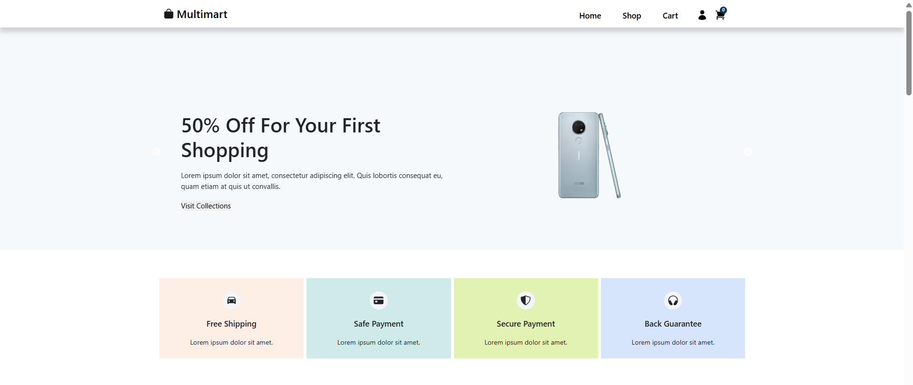

# Maltimart Ecommerce

## 📌 Live Demo
[https://multimart-ecommerce.onrender.com](https://multimartecommerce.vercel.app/)

## 😎 Features

- Beauty UI similar to ecommerce website
- Fully responsive and mobile friendly
- User can add items to cart
- User can view details of an item
- User can show total price in cart
- In Item page user can add quantity of item to cart instead of click add more and more
  ### 🏠 Homepage
  


## 🚀 What technologies were used?


- react.js (create-react-app)
- react-dom-router
- react-bootstrap
- state management using Redux Toolkit

## How can you clone and tweak this project?

From your command line, first clone this repo:

```

# Go into the repository
$ cd multimart-react-ecommerce

# Remove current origin repository
$ git remote remove origin

```

Then you can install the dependencies using NPM:

```
# Install dependencies
$ npm install

# Start development server
$ npm start
```
👨‍💻 Happy coding!
---
